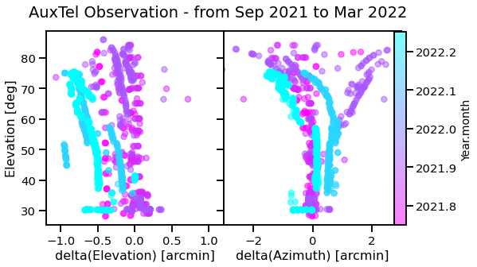

:tocdepth: 1

.. Please do not modify tocdepth; will be fixed when a new Sphinx theme is shipped.

.. sectnum::

.. TODO: Delete the note below before merging new content to the main branch.

Iin this tech note, the on sky pointing accuracy of the Auxiliary Telescope (AuxTel) images is checked. 

The notebook of this analysis can be found here: https://github.com/estevesjh/ComScratchStuff/tree/main/AuxTel/pointingTracking

Last Revision: 2022-04-05

.. note::

   **This technote is not yet published.**
   Work in progress. To do: - polish text on the second section; add comments for each plot; add the link of the plot on the executive summary.

..  _Pointing-Model-Verification-Executive-Summary:

Executive Summary
============

**Goal**: check the pointing ability of the AuxTel telescope to slew to a given sky coordinate for the night runs from Feb 2020 up to Mar 2022.

**Method**: The pointing coordinate given by the boresight is compared to the world coordinate system (WCS) solution of the AuxTel images. 
The WCS solutions were taken from the DM Stack Pipeline images that passed the `calibration task`, which provides a pointing accuracy within ~0.25 arcesc. 

**Main findings**:

- Comparing the angular offset of the two sky coordiantes we report an overall pointing precision of 57arcsec. 

- The pointing offset changes signficantly monthly with the changes on the pointing model. 

- The best pointing model found on this analysis is the one from Oct 2021, note: The pointing model from Nov 2021 was not updated for the observations runs of Feb and Mar 2202.

- Looking into these months we found an initial offset on the AlAz of (-0.1, 0.5) arcmin on Feb 2022 which involved to be (-0.5, 0.) arcmin in Mar 2022.
 
- Finally, we looked for correlations of the pointing offset with the some metadata properties, we didn't find any signficant correlation. 

..  _Pointing-Model-Verification-202203:

AuxTel Pointing Verification 2022/03
===============

In this notebook is shown how the data was acquired, the pointing precision timeline, AzEl offsets as a function of the elevation and a correlaiton matrix.

The Dataset
------------------

Basically, we query the WCS solution from the bulter calibrate task, the
boresight pointing position and some information from the exposure
metadata. The sample was queried using the script
``query_pointing_bluter_reviewed.py``.

The main quantities of this dataset are: - ``RA``, ``DEC`` : pointing
sky position from the boersight - ``RA_WCS``, ``DEC_WCS`` : pointing sky
position from the wcs solutions - ``PNT_OFFSET``: angular distance
between the two pointings.

The other columns are exclusively from the metadata and the end with
``_MD``: ``RA``,
``DEC``,\ ``MJD``,\ ``EXPTIME``,\ ``TEMP_SET``,\ ``CCDTEMP``,\ ``FILTER``,\ ``ELSTART``,\ ``ELEND``,\ ``AZSTART``,\ ``AZEND``

The file ``data/rev_checking_auxtel_pointing_{date}.csv`` contains info
about 1421 exposures taken from Feb 2020 up to Nov 2021. The collection
used to generate this file was
``u/mfl/testProcessCcd_srcMatchFull_181e6356``. And it’s from the
``lsst.rapid.analysis.butlerUtils``.

Caveat: Not all the images from the observation nights. The calibration
filters exposures selecting preferentially crowded fields.

Loading the data
------------------
Each file corresponds to an outputed collection from the rapid analysis pipeline. 

.. code:: ipython3

    import pandas as pd
    
    df0 = pd.read_csv('data/rev_checking_auxtel_pointing_24032022.csv',index_col=0)
    df1 = pd.read_csv('data/rev_checking_auxtel_pointing_Feb2022.csv',index_col=0)
    df2 = pd.read_csv('data/rev_checking_auxtel_pointing_Mar2022.csv',index_col=0)
    
    df = pd.concat([df0,df1,df2])
    df.DATE = pd.to_datetime(df.DATE)#.dt.date

    
Pointing Offset Precision Timeline
^^^^^^^^^^^^^^^^^^^^^^
.. code:: ipython3

    df1['PNT_OFFSET'].hist(bins=mybins,label=f'Feb 2020 - Mar 2022',density=False,lw=4)
    df1['PNT_OFFSET'][sep_up].hist(bins=mybins,label=f'After Sep 2021',density=False, histtype='step',lw=4)
    
    plt.axvline(pm,color='gray',ls='--',lw=3, label=r'median = %.2f arcsec'%(pm*60))
    plt.axvline(pm+s68,color='k',ls='--',lw=3, label=r'$\sigma_{68}$ = %.2f arcsec'%((pm+s68)*60))
    
    plt.title(f'AuxTel Observation Runs',fontsize=16)
    plt.xlabel('Pointing Offset [arcmin]',fontsize=16)
    plt.legend(fontsize=12)
    plt.tight_layout()
    plt.savefig(f'figures/rev_pointing_offset_distribution_{date}.png',facecolor='w',transparent=False,dpi=100)

.. code:: ipython3

    fig = plt.figure(figsize=(10,5))
    sns.stripplot(x=df.month_year, y='PNT_OFFSET', palette="cool", data=df, dodge=True, alpha=.5, zorder=1)
    ax = sns.pointplot(x=df.month_year, y='PNT_OFFSET', data=df, markers="d", color="black", scale=.75, ci=99, join=False)
    
    ax.axhline(10/60,color='k',ls='--',lw=3, label='Pointing Req.\n 10 arcsec')
    ax.set_ylabel('Pointing Offset [acrmin]')
    ax.set_xlabel('')
    ax.set_title('AuxTel Observation Runs')
    ax.legend(fontsize=12)
    ax.tick_params(axis='x', rotation=60)
    fig.tight_layout()
    fig.savefig(f'figures/pointing_offset_monthly_{date}.png',facecolor='w',transparent=False,dpi=100)

.. code:: ipython3

    # fig = plt.figure(figsize=(10,4))
    # plt.subplot(1, 2, 1)
    
    fig, axs = plt.subplots(1,2, figsize=(8, 4.5), sharey='all')
    plt.subplots_adjust(wspace=0.)
    im =axs[0].scatter(df1.dEL[sep_up], df1.EL[sep_up], alpha=0.5, s=50, c=df1.year[sep_up], cmap='cool_r')
    # plt.scatter(df1.dEL[outliers2], df1.EL[outliers2], s=50, alpha=0.6)
    axs[0].set_ylabel('Elevation [deg]',fontsize=16)
    axs[0].set_xlabel('delta(Elevation) [arcmin]',fontsize=16)
    
    # axs[0].legend(fontsize=14)
    # plt.colorbar()#.set_label('PNT_OFFSET [arcmin]',fontsize=14)
    # plt.title(f'AuxTel Observation Runs',fontsize=16)
    
    axs[0].set_xlim(-1.2,1.2)
    axs[1].set_xlim(-3.,3.)
    
    axs[1].scatter(df1.dAZ[sep_up], df1.EL[sep_up], alpha=0.5, s=50,label=f'{len(df1)} Fields', c=df1.year[sep_up], cmap='cool_r')
    axs[1].set_xlabel('delta(Azimuth) [arcmin]',fontsize=16)
    
    plt.draw()
    p0 = axs[0].get_position().get_points().flatten()
    p1 = axs[1].get_position().get_points().flatten()
    ax_cbar = fig.add_axes([p1[2]-0.015, 0.125, 0.025, p1[2]-p0[0]-0.025])
    fig.colorbar(im, cax=ax_cbar).set_label('Year.month',fontsize=14)
    fig.subplots_adjust(wspace=0.)
    fig.suptitle('AuxTel Observation - from Sep 2021 to Mar 2022')
    fig.savefig(f'figures/elevation_offsets_Sep2021_Mar2022.png',facecolor='w',transparent=False,dpi=100)

.. code:: ipython3

    # Compute the correlation matrix
    df1b = df2.copy()
    df1b.dEL = np.abs(df1b.dEL)
    df1b.dDEC = np.abs(df1b.dDEC)
    
    df1b.dAZ = np.abs(df1b.dAZ)
    df1b.dRA = np.abs(df1b.dRA)
    
    df_corr = df1b.corr()
    
    # Generate a mask for the upper triangle
    mask = np.triu(np.ones_like(df_corr, dtype=bool))
    
    mask = mask[1:, :-1]
    corr = df_corr.iloc[1:,:-1].copy()
    
    # Set up the matplotlib figure
    f, ax = plt.subplots(figsize=(11, 9))
    
    # Generate a custom diverging colormap
    cmap = sns.diverging_palette(230, 20, as_cmap=True)
    
    # Draw the heatmap with the mask and correct aspect ratio
    sns.heatmap(corr, mask=mask, cmap=cmap, vmax=0.5, vmin=-0.5, center=0,
                square=True, linewidths=.5, cbar_kws={"shrink": .5})
    
    plt.title(f'AuxTel Pointing Investigation - {len(df1)} Fields \n Observation Runs From Feb 2020 up to Nov 2021',fontsize=16)
    plt.savefig(f'figures/rev_correlation_matrix_{date}.png',facecolor='w',transparent=False,dpi=100)

We should took more data. Build new look up table for the hexapod. Then,
rebuild the pointing model and check the new pointings. Everything above
70 deg elevation is extrapolation.

Check with Patrick if there’s some data for the hexapod lookup table.

Put there the main findings of this trend analysis.
https://tstn-014.lsst.io/#change-record

.. ..  _Pointing-Model-Verification-202203-Data-Acquisition:

.. Data-Acquisition
.. ============

.. ..  _Pointing-Model-Verification-202203-Pointing-Offset-Timeline:

.. Pointing-Offset-Timeline
.. ============

.. ..  _Pointing-Model-Verification-202203-Elevation-Offsets:

.. Elevation-Offsets
.. ============

.. ..  _Pointing-Model-Verification-202203-Correlations:

.. Correlations
.. ============

.. ..  _Pointing-Model-Verification-202203-Data-Acquisition:

.. Data-Acquisition
.. ============

.. ..  _Pointing-Model-Verification-202203-Pointing-Offset-Timeline:

.. Pointing-Offset-Timeline
.. ============

.. ..  _Pointing-Model-Verification-202203-Elevation-Offsets:

.. Elevation-Offsets
.. ============

.. ..  _Pointing-Model-Verification-202203-Correlations:

.. Correlations
.. ============

.. .. rubric:: References

.. Make in-text citations with: :cite:`bibkey`.

.. .. bibliography:: local.bib lsstbib/books.bib lsstbib/lsst.bib lsstbib/lsst-dm.bib lsstbib/refs.bib lsstbib/refs_ads.bib
..    :style: lsst_aa
